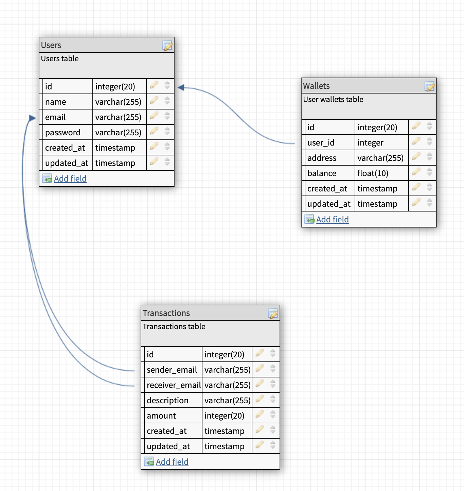

# Lendsqr Demo Credit Wallet

This module provides wallet and transaction management functionality in an Express.js application using TypeScript. It includes features for creating users, managing wallets, and transferring funds between users. It connects to a relational database via Knex, ensuring efficient and transactional handling of balances.

## Overview

The Wallet and Transaction Management Module allows users to:

- Create user accounts.
- Create wallets associated with users.
- Perform wallet operations (fund, transfer and withdraw).
- Transfer funds between users’ wallets, ensuring transactional integrity.

This implementation uses Knex for database operations and TypeScript for type safety. Error handling and logging are integrated to make debugging and monitoring easier.

## Getting Started

### Prerequisites

- Node.js
- MySQL(v5.7.38) or other relational database compatible with Knex
- Environment variables configured (see below)

### Installation

1. Clone the repository and navigate to the project root.

```bash
git clone https://github.com/thectogeneral/lendsqr-wallet-service.git
```

2. Install dependencies:

```bash
npm install
```

3. Set up environment variable

```plaintext
MYSQL_ROOT_PASSWORD=
MYSQL_DATABASE=

APP_PORT=
NODE_ENV=
DB_HOST=
DB_PORT=
DB_USER=
DB_PASSWORD=
DB_NAME=
DB_CLIENT=

TOKEN=

API_BASE_URL=
API_KEY=
APP_ID=
FRONT_END_URL=

```

4. Start the server:

```bash
npm run dev
```

5. Configure Knex and migrate the database if needed.

```
npm run migrate
```

6. Run Test

```
npm run test
```

Note: Please ensure to use a valid token for the test environment

## Key Classes and Functions

### Models

1. User: Represents a user with basic details (first_name, last_name, email, password).
2. Wallet: Represents a wallet tied to a user with fields for address, balance, and user_id.
3. Transaction: Represents a transaction between users, including sender_email, receiver_email, description, and amount.

### Services

1. `createUser`: Adds a new user to the users table.
2. `createWallet`: Creates a wallet associated with a user ID.
3. `findUserWallet`: Retrieves a user’s wallet by user_id, with error handling.
4. `updateWalletBalance`: Updates the wallet balance, allowing either additions or deductions.
5. `transferFunds`: Manages the transfer of funds from one user to another with transactional handling.

### Error Handling

This module uses a custom AppError class to handle errors consistently. Errors are wrapped in try-catch blocks for all database operations, providing detailed error responses to clients and error logs for internal tracking.

### Logging

The module includes a Logger utility to log both successful operations and errors. This can be configured to log to the console or an external logging service.

### Transactions and Atomicity

The transferFunds function uses Knex’s transaction capabilities to ensure atomicity. This function handles:

1. Deducting the balance from the sender’s wallet.
2. Adding the balance to the receiver’s wallet.

If any step fails, the entire transaction is rolled back to maintain data consistency.

### API Endpoints

POST /register

Description: Creates a new user.

Request:

```json
{
  "first_name": "John",
  "last_name": "Doe",
  "email": "johndoedoe2@example.com",
  "password": "SecurePassword123",
  "passwordConfirmation": "SecurePassword123"
}
```

POST /login

Description: Login a user.

Request:

```json
{
  "email": "johndoedoe2@example.com",
  "password": "SecurePassword123"
}
```

## Database model diagram


